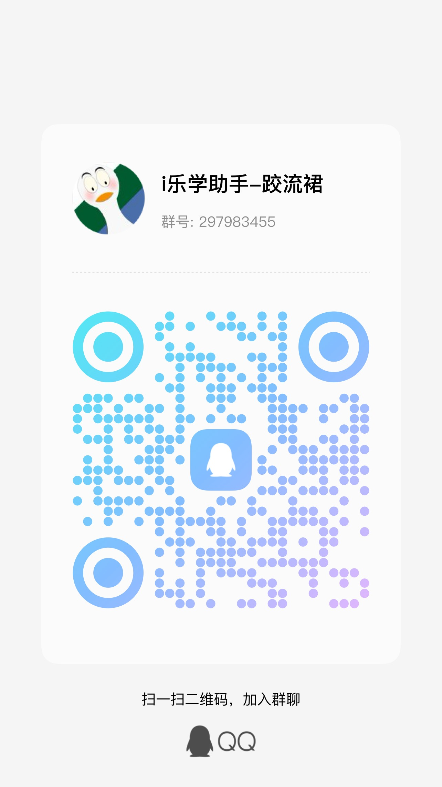
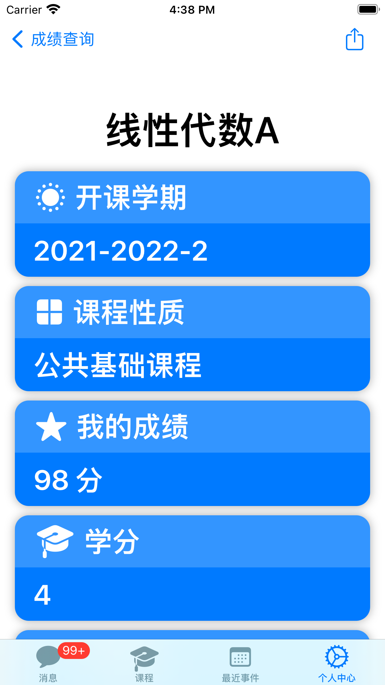
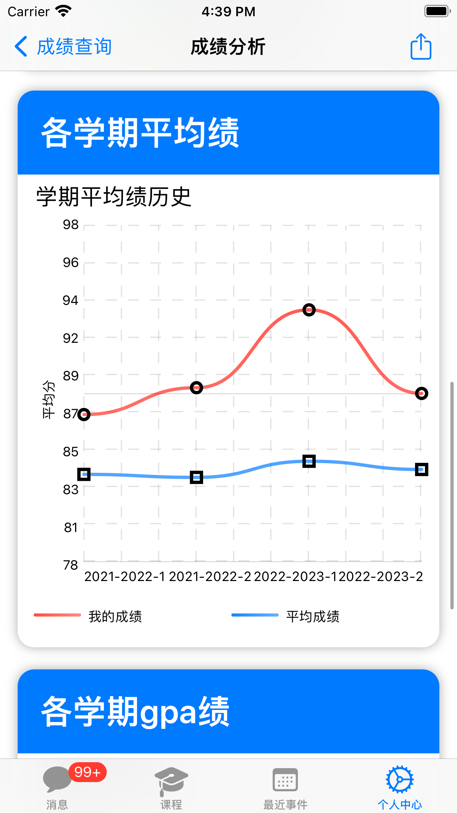
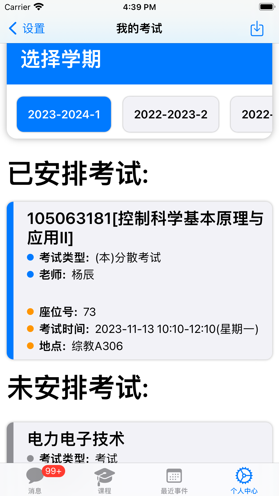

<h1>i乐学助手</h1>
<h2>一款让你在ios上更方便使用乐学的app</h2>
<a href="./LexueSwiftUI/AboutApp.md">关于i乐学助手</a>
  |
  <a href="./LexueSwiftUI/PrivacyAgreement.md">用户隐私协议</a>
   

# 交流群

# 一、特性

## ⭐️ 多端同步，无感切换

“i乐学助手”现在原生支持ios15+，ipados15+以及macos，在强有力的iCloud同步加持下，您将获得三端一致的使用体验

您现在可以在ipad、mac端也能享受到“i乐学助手”的强有力小组件，查成绩等功能

## ⭐️ 成绩查询，详尽分析

得益于BIT101接口的加成，i乐学助手可以快速的查询您的学业成绩，并以表格展示基本信息，您还可以点击进入查看每门课程更详尽的分析结果，或者所有课程的综合分析结果。

您还可以直接将成绩分析结果作为长截图一键保存至相册，或者分享给他人。

## ⭐️ 考试日程，一键添加

您可以通过i乐学助手快捷的查看最近的考试安排信息，然后一键导入到最近事件列表中，在最近事件列表中对考试事件进行进一步编辑，或者导出到ios系统日历。

## ⭐️ 乐学事件，自动导入

自动导入最近7天的乐学ddl事件（如作业提交、讨论截止等），可从app内快捷进入作业提交界面，不让你错过每个乐学的DDL。支持手动添加ddl(你可以使用文字描述来调用gpt帮你自动添加)，你还可以直接将每个事件的数据导入ios系统日历。

## ⭐️ 消息聚合，运筹帷幄

登录i乐学助手，在消息源选择订阅多达50多种通知种类，全校消息通知任你掌握，不错过每一次机遇，做更好的自己。

## ⭐️ 精美组件，随时在线

放置i乐学助手小组件，随时随刻提醒你今日待办事项，并随时保持最新状态。

## ⭐️ 聊天逻辑，直观清晰

每一个消息源，每一门课程都是你的联系人，向你发送对你重要的消息，这种社交逻辑更方便你接收信息。

## ⭐️ 课程列表，极速直达

带有缓存优化的课程列表，让你极速直达想要的课程，你可以收藏需要的课程课件链接，然后随时从收藏列表中打开。

# 二、更新日志

## 2023-10-30: AppStore 1.3

### 新增功能：

- [x] ipad端、mac端适配

➕ 现在“i乐学助手”原生支持ipad端以及m系列的mac端，在强有力的iCloud同步加持下，您将获得三端一致的使用体验

➕ 您现在可以在ipad、mac端也享受到“i乐学助手”的强有力小组件，查成绩等功能

- [x] iCloud同步

➕ “i乐学助手”现在支持iCloud同步您的数据，方便且安全。您的自定义事件，联系人信息，以及课程收藏链接等信息，甚至是消息源设置，均可以通过iCloud与其他的设备如ipad，mac设备同步保持最新，卸载应用重装也不用担心消息丢失

- [x] 新增“持续事件”选项

➕ 您的自定义事件现在支持选择“持续事件”，这样您就可以指定事件在一段时间内发生，考试安排导入功能也进行加强，导入的不再是一个时间点，而是一个时间段，小组件上也进行了响应的调整，导入到系统日历时，也能对应的讲一个时间段添加到系统日历中

你可以通过文字描述录入，现在由GPT驱动的文字录入模块也支持了持续事件录入，试试输入“明天早上9点到12点提醒我去理教楼自习”

### 修复问题

- 修复“刷新中”反复跳出的问题

🔧 限制显示“刷新中”窗口的时间，防止反复跳出影响使用体验

- 修复消息聚合推送不及时问题

🔧 禁用HaoBIT的缓存策略，后端拉取消息更及时

 🔧 修复“分享综合分析成绩单”时，生成的长截图logo显示不全的问题

 🔧 其他细节修复

### 已知的待修复的问题

- [ ] 通过内置浏览器提交乐学作业时，拍照后返回会重复刷新导致提交失败的问题
- [ ] 本地已经删除，或者已经完成的事件依然可能在乐学事件更新的时候被覆盖

## 2023-10-19: AppStore 1.2 

### 新增功能：

- [x] 成绩查询功能

​		➕ 方便快捷查询成绩，个性化成绩分析，支持一键分享导出成绩分析截图，随时掌控自己的成绩

- [x] 考试查询功能

​		➕ 一键查询考试安排，支持导入到事件列表里，尽早开始准备考试计划~

- [x] 触感提升

​		➕ 部分操作添加震动反馈，提升程序触感

### 问题修复：

- 流量消耗问题

​		🔧 解决刷新过于频繁造成流量消耗过多问题，重新设计消息拉取逻辑，使用apns推送服务，极大减少流量消耗，提高消息接收的敏捷度

- 乐学刷新效率问题

​		🔧 改用新的接口，从月视图获取ddl事件，更加高效，进一步减少消耗的流量

- 事件浏览功能修复

​		🔧 修复了已完成的ddl无法通过事件浏览打开事件链接的逻辑bug

- gpt添加事件的成功率

​		🔧 优化处理gpt返回的逻辑，进一步提升使用gpt添加事件的成功率

- 修复app可能崩溃的问题

​		🔧 修复了app内用浏览器请求摄像头时，因为未请求权限造成的崩溃问题

## 2023-10-10: AppStore 1.0 (xcode 1.1)

### i乐学助手初版发布，具有如下基本功能：

* 乐学事件导入

​		登录i乐学助手，app自动导入乐学平台最近的事件（如作业提交、讨论截止等），并在临期时提醒您处理事件，帮助你摆脱ddl恐惧，自由把握时间。

* 课程直达

​		打开app即可快速访问乐学课程，收藏你关注的乐学课程、课程链接，即可快速直达。

* 消息聚合

​		登录i乐学助手，在消息源选择订阅多达50多种通知种类，全校消息通知任你掌握，不错过每一次机遇，做更好的自己。

* 小组件提醒

​		放置i乐学助手小组件，随时随刻提醒你今日待办事项，并随时保持最新状态。

### 已知的待修复的问题：

- [x] 自动刷新新事件频率太频繁，造成大量冗余的请求，消耗不必要的流量，需要优化请求方式（1.2版本修复）

- [x] 获取乐学时间方式不够高效，没有从月视图直接获取事件，而是一天一天去拉取，消耗网络资源，需要优化获取方式（1.2版本修复）

# 三、未来待添加的功能

- [ ] 增加校园导航功能，内置良乡校区的校园地图，结合ios位置服务，解决文萃楼迷宫等问题，便利新生找到全校各处位置
- [ ] 北理工邮箱一键订阅查看，因为现在北理工邮箱不再支持自动转寄，因此查看邮件很不方便，我们希望将邮箱功能也引入”i乐学助手“
- [ ] 增加空闲教室一键筛选功能，快速筛选全校空闲教室，自习活动更加方便

- [ ] 增加类社交功能如：融合 apple 运动健康进行运动竞赛、每日番茄钟竞赛

