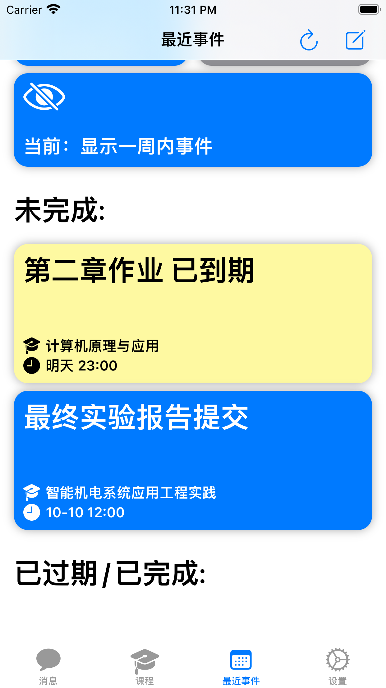
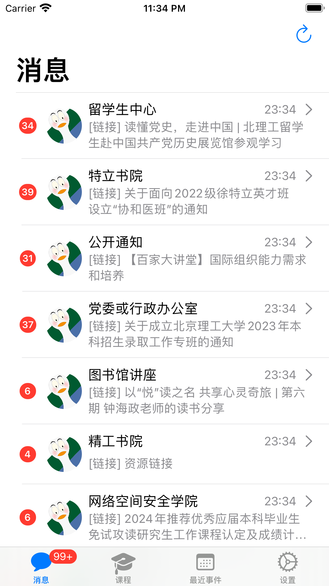
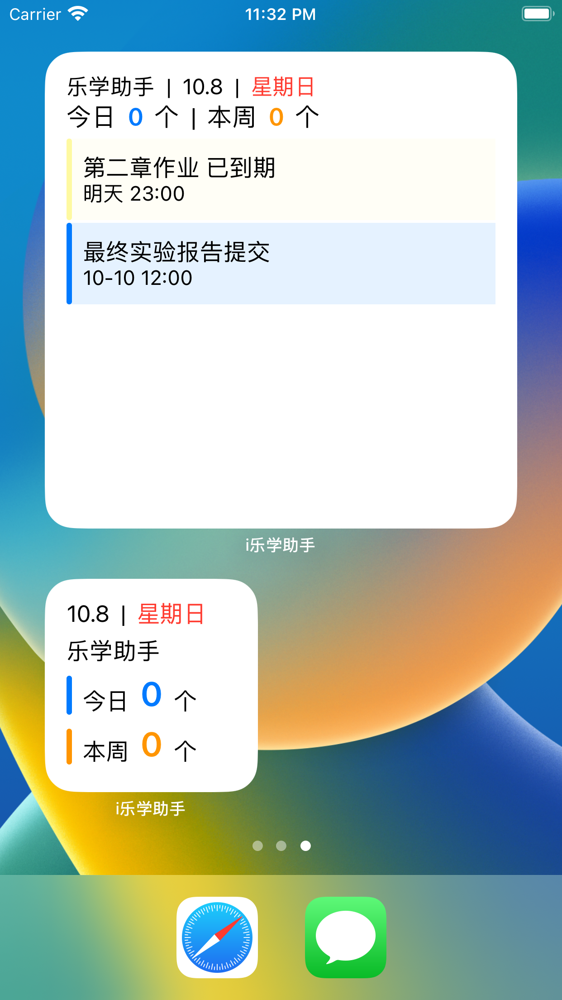
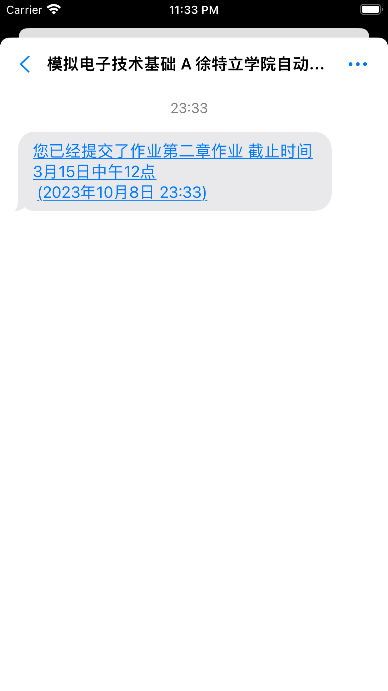
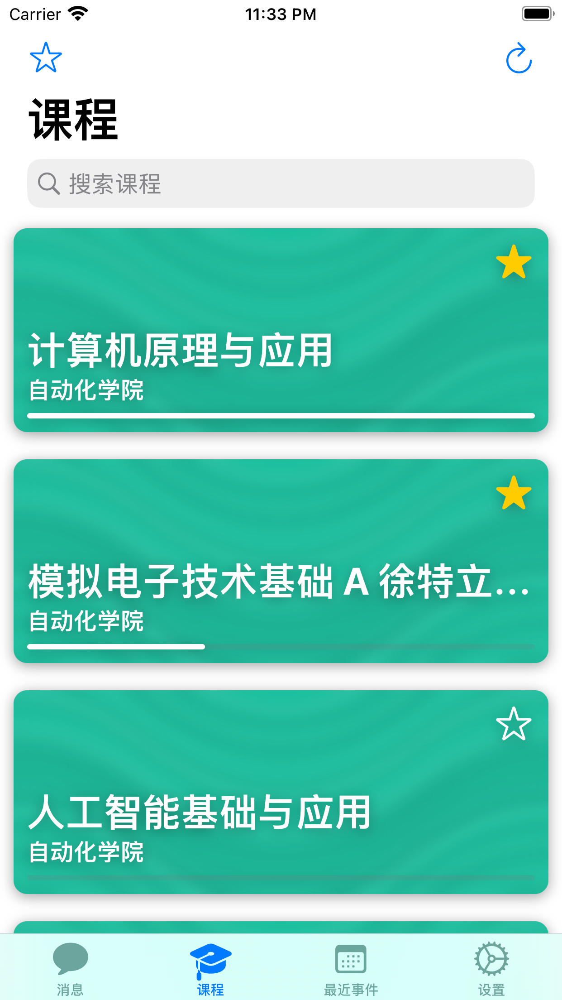

<h1>i乐学助手</h1>
<h2>一款让你在ios上更方便使用乐学的app</h2>

# 一、特性

## ※ 乐学事件，自动导入

自动导入最近7天的乐学ddl事件（如作业提交、讨论截止等），可从app内快捷进入作业提交界面，不让你错过每个乐学的DDL。支持手动添加ddl(你可以使用文字描述来调用gpt帮你自动添加)，你还可以直接将每个事件的数据导入ios系统日历。

## ※ 消息聚合，运筹帷幄

登录i乐学助手，在消息源选择订阅多达50多种通知种类，全校消息通知任你掌握，不错过每一次机遇，做更好的自己。

## ※ 精美组件，随时在线

放置i乐学助手小组件，随时随刻提醒你今日代办事项，并随时保持最新状态。

## ※ 聊天逻辑，直观清晰

每一个消息源，每一门课程都是你的联系人，向你发送对你重要的消息，这种社交逻辑更方便你接收信息。

## ※ 课程列表，极速直达

带有缓存优化的课程列表，让你极速直达想要的课程，你可以收藏需要的课程课件链接，然后随时从收藏列表中打开。

# 二、更新日志

## 2023-10-10: AppStore 1.0 (xcode 1.1)

**i乐学助手初版发布，具有如下基本功能：**

* 乐学事件导入

登录i乐学助手，app自动导入乐学平台最近的事件（如作业提交、讨论截止等），并在临期时提醒您处理事件，帮助你摆脱ddl恐惧，自由把握时间。

* 课程直达

打开app即可快速访问乐学课程，收藏你关注的乐学课程、课程链接，即可快速直达。

* 消息聚合

登录i乐学助手，在消息源选择订阅多达50多种通知种类，全校消息通知任你掌握，不错过每一次机遇，做更好的自己。

* 小组件提醒

放置i乐学助手小组件，随时随刻提醒你今日代办事项，并随时保持最新状态。

**已知的待修复的问题**：

* 自动刷新新事件频率太频繁，造成大量冗余的请求，消耗不必要的流量，需要优化请求方式
* 获取乐学时间方式不够高效，没有从月视图直接获取事件，而是一天一天去拉取，消耗网络资源，需要优化获取方式

# 三、未来待添加的功能

* 深入与ios融合，对于公共消息如HaoBIT类消息，不再使用主动请求+diff的方式获取新消息，而是采用ios的消息推送服务APNs，在服务端请求HaoBIT的新事件，并推送给i乐学助手的用户
* 添加成绩分析功能，调用BIT101接口登录获取成绩，并以可视化的界面分析成绩，支持成绩截图分享
* 添加考试安排自动导入功能，从教务拉取当前用户的考试安排，自动导入事件列表，便利考试周用户
* 增加空闲教室一键筛选功能，快速筛选全校空闲教室，自习活动更加方便
* 增加类社交功能如：融合 apple 运动健康进行运动竞赛、每日番茄钟竞赛
* 增加校园导航功能，内置良乡校区的校园地图，结合ios位置服务，解决文萃楼迷宫问题，便利新生找到全校各处位置
